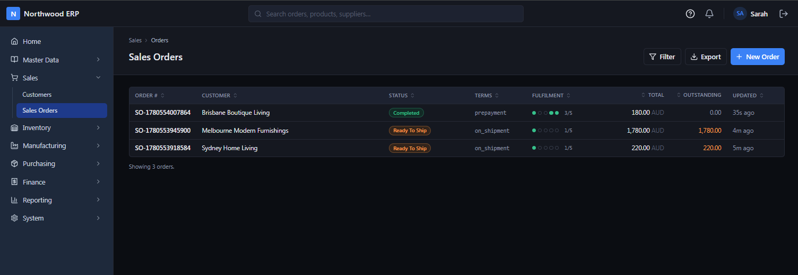

# Northwood ERP

Event-driven microservices architecture showcase for **CQRS**, **Saga orchestration**, and the **transactional outbox/inbox** pattern, structured around a small ERP domain (sales, inventory, manufacturing, purchasing, finance, reporting). Plus a **React operational ERP SPA** over the services.

Underneath the buzzwords it's one architectural idea applied uniformly: every service is a domain-specific journal whose facts are events, with running totals as derived projections — **Pacioli's 1494 double-entry discipline generalised to non-monetary domains** (inventory keeps the books on physical units, manufacturing on WIP and labour, sales on customer commitments). The deepest framework here isn't Spring; it's Pacioli. See [`docs/architecture.md`](docs/architecture.md) → *Why this codebase looks the way it does — ERP as applied accounting epistemology* for the full framing.

This README is a 30-second orientation. Every link below points at the doc that actually answers the corresponding question.

## Screenshots

_The operational ERP SPA — the Sales Orders list, served by the BFF from the reporting service's cross-context projection._



## What's here

```
Northwood/
├── pom.xml                       Parent POM
├── docker-compose.yml            Postgres 17 + Kafka 4.1.2 (KRaft, single broker) + Keycloak 26 + LGTM stack (Prometheus/Tempo/Loki/Grafana)
├── docker-compose.seed.yml       Override — layer on to also load the demo seed (config/postgresql/northwood_erp_seed.sql)
├── db/                           Baseline schema + roles/grants (northwood_erp.sql), seed, Keycloak realm + LGTM configs (prometheus/tempo/loki/promtail/grafana)
│
├── shared-kernel/                Pure Java value objects (Money, Quantity, Sku, …)
├── shared/                       Outbox/inbox base, EventEnvelope, Kafka publisher, Saga base (split: `shared.application.*` ports, `shared.infrastructure.*` adapters, `shared.api.*` audit REST)
│
├── product-events/               Published event contracts (wire types + EVENT_TYPE) — the only cross-service API
├── product-service/              SKUs, pricing, reorder policy (Material Master / Shape A hub)
├── sales-events/                 Published event contracts (wire types + EVENT_TYPE)
├── sales-service/                Sales orders + sales_order_fulfilment_saga
├── inventory-events/             Published event contracts (wire types + EVENT_TYPE)
├── inventory-service/            Stock balances, reservations, goods receipts, shipments
├── manufacturing-events/         Published event contracts (wire types + EVENT_TYPE)
├── manufacturing-service/        Work orders, BOMs, routing + work_order_saga
├── purchasing-events/            Published event contracts (wire types + EVENT_TYPE)
├── purchasing-service/           POs, requisitions, supplier prices + purchase_to_pay_saga
├── finance-events/               Published event contracts (wire types + EVENT_TYPE)
├── finance-service/              AP/AR invoices, payments, journal entries (perpetual inventory)
├── reporting-service/            Six read-side projections, inbox-only (no events module — consumes only)
│
├── erp-web-ui-bff/               BFF for the operational ERP SPA (port 8089)
├── erp-web-ui/                   React + Vite SPA — operational ERP (port 5174)
│
├── terraform/                    AWS IaC — single-AZ EC2 + docker-run demo (network · infra-ec2 · ecr · secrets · bootstrap)
└── docs/                         Architecture, conventions, messaging, sagas, observability, AWS, demo runbook
```

17 Maven modules + the ERP SPA (six `*-events` jars carrying the published wire contracts, plus `test-harness`). Every Java service has full DDD layering (`domain` / `application` / `infrastructure` / `api`); all three Sagas drive end-to-end; reporting projects six cross-context views.

## Stack

- **Java 21**, **Spring Boot 4.0.5** (Spring Framework 7, Jakarta EE 11), Maven multi-module
- **PostgreSQL 17** with schema-per-service in one DB (`search_path = <service>, shared` per connection)
- **Liquibase** for migrations (manually wired — Spring Boot 4 doesn't ship the auto-config)
- **Spring Data JDBC** (chosen over JPA for explicit aggregate boundaries)
- **Kafka 4.1.2** (KRaft, single broker) — wire format JSON via Jackson 3
- **Keycloak 26** + Spring Security — OIDC code flow for the ERP SPA (see [Demo credentials & secrets](#demo-credentials--secrets))
- **Testcontainers** for the integration-test seam
- **React 18 + Vite + Tailwind v4** for the ERP SPA; **TanStack Query** for data fetching
- **OpenTelemetry + LGTM stack** — Prometheus (metrics) · Tempo (OTLP traces) · Loki (logs) · Grafana, as compose sidecars; every service + the BFF auto-instrumented, one correlated trace per Saga across services
- **Terraform** IaC for the AWS demo — single-AZ EC2 running the images via `docker run`, pushed to ECR

## Requirements

| Tool | Version | For |
|---|---|---|
| JDK | 21 | All Java modules |
| Maven | 3.9+ | Multi-module build |
| Docker + Compose | recent | Postgres 17, Kafka 4.1.2, Keycloak 26, LGTM observability (Prometheus/Tempo/Loki/Grafana) |
| Node.js + npm | 20+ | The React/Vite ERP SPA |

Developed on Windows (PowerShell), but the build is OS-neutral — macOS and Linux work with the same Maven / npm / Docker commands; translate the PowerShell snippets below to your shell.

## Run it

Quick backend smoke:

```powershell
docker compose up -d                        # infra, empty schema (postgres + kafka + keycloak)
# ↑ for a database pre-loaded with demo fixtures instead, layer in the seed override:
#   docker compose -f docker-compose.yml -f docker-compose.seed.yml up -d
mvn install -DskipTests
$env:SPRING_PROFILES_ACTIVE = "kafka"
mvn -pl product-service spring-boot:run     # one service in one terminal
```

For the **operational ERP UI**, follow [`erp-web-ui/README.md`](erp-web-ui/README.md): bring up Postgres + reporting-service + `erp-web-ui-bff`, then `npm run dev` in `erp-web-ui/` and open `http://localhost:5174` and sign in. The full multi-service walkthrough lives in **`docs/demo-script.md`**.

The **LGTM observability tier** comes up with the same `docker compose up`. With services running under the `kafka` profile, open **Grafana at <http://localhost:3000>** (anonymous admin) to watch a single placed order as one correlated trace (Tempo) → logs (Loki) → RED metrics (Prometheus) across sales → inventory → finance. Wiring + worked example: [`docs/observability.md`](docs/observability.md).

## Demo credentials & secrets

Everything ships with **demo-grade** credentials so the stack boots with zero setup. They are deliberately weak and committed to the repo — **override every one of them before exposing this to anything beyond localhost.**

| Secret | Default | Override | Where |
|---|---|---|---|
| Keycloak BFF client secret | `northwood-bff-secret` | `KEYCLOAK_BFF_CLIENT_SECRET` | `erp-web-ui-bff` OIDC client |
| 13 demo user passwords | password = username (e.g. `sarah` / `sarah`) | re-import the realm with new credentials | `config/keycloak/northwood-realm.json` |
| Keycloak bootstrap admin | `admin` / `admin` | `KC_BOOTSTRAP_ADMIN_USERNAME` / `KC_BOOTSTRAP_ADMIN_PASSWORD` | `docker-compose.yml` |
| 7 service DB passwords | `postgres` | `<SERVICE>_DB_PASSWORD` (+ `<SERVICE>_DB_USER`, `<SERVICE>_DB_URL`) | each service's `application.yml` |

The ERP SPA (`erp-web-ui`) authenticates real Keycloak users via OIDC code flow; the services validate the resulting JWT as resource servers. Set a real `KEYCLOAK_BFF_CLIENT_SECRET` and re-import the realm with strong user credentials before any non-localhost deployment.

## Where to read next

| If you want to… | Open |
|---|---|
| Run the ERP UI | `erp-web-ui/README.md` |
| Run a demo end-to-end | `docs/demo-script.md` |
| Understand the architecture before changing code | `CLAUDE.md` |
| Observe traces / metrics / logs | `docs/observability.md` |
| Deploy to AWS with Terraform | `terraform/README.md` (IaC) · `docs/aws-deployment.html` (demo) · `docs/aws-architecture.html` (production) |

## Tests

```powershell
mvn test                                       # all 621 backend unit tests
mvn -pl inventory-service verify               # Testcontainers seam IT (~50s)
cd erp-web-ui ; npm.cmd run build ; cd ..      # ERP SPA typecheck + bundle
```

## Tear down

```powershell
docker compose down -v        # wipe Postgres + Kafka volumes for a clean slate
```

## License

[Apache 2.0](LICENSE) — Copyright 2026 Chi Liu.
