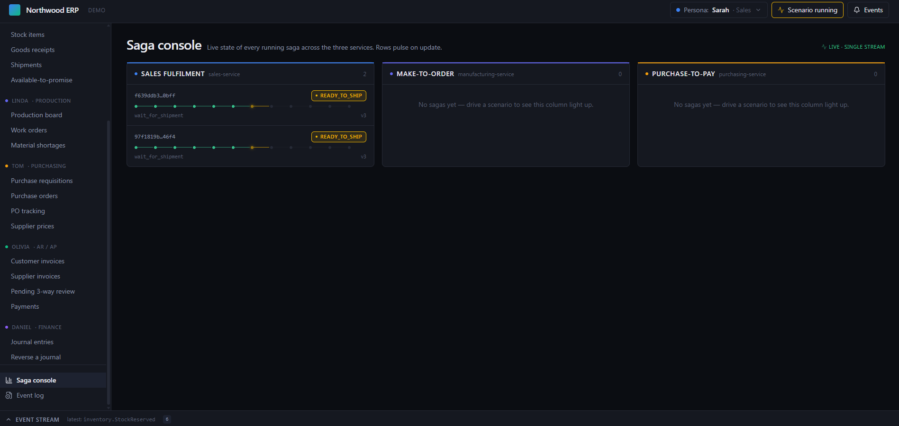

# Northwood ERP

Event-driven microservices architecture showcase for **CQRS**, **Saga orchestration**, and the **transactional outbox/inbox** pattern, structured around a small ERP domain (sales, inventory, manufacturing, purchasing, finance, reporting). Plus two React demo UIs that make it watchable for an audience.

Underneath the buzzwords it's one architectural idea applied uniformly: every service is a domain-specific journal whose facts are events, with running totals as derived projections — **Pacioli's 1494 double-entry discipline generalised to non-monetary domains** (inventory keeps the books on physical units, manufacturing on WIP and labour, sales on customer commitments). The deepest framework here isn't Spring; it's Pacioli. See [`docs/architecture.md`](docs/architecture.md) → *Why this codebase looks the way it does — ERP as applied accounting epistemology* for the full framing.

This README is a 30-second orientation. Every link below points at the doc that actually answers the corresponding question.

## Screenshots

_The technical demo SPA's Saga Console + Event Log driving a place-order flow across all seven services in real time._



## What's here

```
Northwood/
├── pom.xml                       Parent POM
├── docker-compose.yml            Postgres 17 + Kafka 4.1.2 (KRaft, single broker) + Keycloak 26
├── docker-compose.seed.yml       Override — layer on to also load the demo seed (db/northwood_erp_seed.sql)
├── db/northwood_erp.sql          Baseline schema + roles/grants (seed data in northwood_erp_seed.sql)
│
├── shared-kernel/                Pure Java value objects (Money, Quantity, Sku, …)
├── shared/                       Outbox/inbox base, EventEnvelope, Kafka publisher, Saga base (split: `shared.application.*` ports, `shared.infrastructure.*` adapters, `shared.api.*` audit REST)
│
├── product-service/              SKUs, pricing, reorder policy (Material Master / Shape A hub)
├── sales-service/                Sales orders + sales_order_fulfilment_saga
├── inventory-service/            Stock balances, reservations, goods receipts, shipments
├── manufacturing-service/        Work orders, BOMs, routing + make_to_order_saga
├── purchasing-service/           POs, requisitions, supplier prices + purchase_to_pay_saga
├── finance-service/              AP/AR invoices, payments, journal entries (perpetual inventory)
├── reporting-service/            Six read-side projections, inbox-only
│
├── demo-web-ui-bff/              BFF for the technical demo SPA (port 8080)
├── demo-web-ui/                  React + Vite SPA for the technical demo (port 5173)
├── erp-web-ui-bff/               BFF for the operational ERP SPA (port 8089)
└── erp-web-ui/                   React + Vite SPA — operational ERP (port 5174)
```

12 Maven modules + two SPAs. Every Java service has full DDD layering (`domain` / `application` / `infrastructure` / `api`); all three Sagas drive end-to-end; reporting projects six cross-context views.

## Stack

- **Java 21**, **Spring Boot 4.0.5** (Spring Framework 7, Jakarta EE 11), Maven multi-module
- **PostgreSQL 17** with schema-per-service in one DB (`search_path = <service>, shared` per connection)
- **Liquibase** for migrations (manually wired — Spring Boot 4 doesn't ship the auto-config)
- **Spring Data JDBC** (chosen over JPA for explicit aggregate boundaries)
- **Kafka 4.1.2** (KRaft, single broker) — wire format JSON via Jackson 3
- **Keycloak 26** + Spring Security — OIDC code flow for the operational SPA; a shared-secret bypass for the technical demo SPA (see [Demo credentials & secrets](#demo-credentials--secrets))
- **Testcontainers** for the integration-test seam
- **React 18 + Vite + Tailwind v4** for both SPAs; **TanStack Query** + a small scenario runner

## Requirements

| Tool | Version | For |
|---|---|---|
| JDK | 21 | All Java modules |
| Maven | 3.9+ | Multi-module build |
| Docker + Compose | recent | Postgres 17, Kafka 4.1.2, Keycloak 26 |
| Node.js + npm | 20+ | The two React/Vite SPAs |

Developed on Windows (PowerShell), but the build is OS-neutral — macOS and Linux work with the same Maven / npm / Docker commands; translate the PowerShell snippets below to your shell.

## Run it

The full nine-terminal walkthrough — Postgres, Kafka, seven services, BFF, SPA, with the kafka profile per service — lives in **`docs/demo-script.md`**. Quick smoke:

```powershell
docker compose up -d                        # infra, empty schema (postgres + kafka + keycloak)
# ↑ for a database pre-loaded with demo fixtures instead, layer in the seed override:
#   docker compose -f docker-compose.yml -f docker-compose.seed.yml up -d
mvn install -DskipTests
$env:SPRING_PROFILES_ACTIVE = "kafka"
mvn -pl product-service spring-boot:run     # one service in one terminal
```

For the audience-facing demo, follow `docs/demo-script.md` § "Bringing the stack up" and click **🎬 Scenarios → 7.1** at `http://localhost:5173/saga-console`.

## Demo credentials & secrets

Everything ships with **demo-grade** credentials so the stack boots with zero setup. They are deliberately weak and committed to the repo — **override every one of them before exposing this to anything beyond localhost.**

| Secret | Default | Override | Where |
|---|---|---|---|
| Keycloak BFF client secret | `northwood-bff-secret` | `KEYCLOAK_BFF_CLIENT_SECRET` | `erp-web-ui-bff` OIDC client |
| 13 demo user passwords | password = username (e.g. `sales-clerk` / `sales-clerk`) | re-import the realm with new credentials | `db/keycloak/northwood-realm.json` |
| Keycloak bootstrap admin | `admin` / `admin` | `KC_BOOTSTRAP_ADMIN_USERNAME` / `KC_BOOTSTRAP_ADMIN_PASSWORD` | `docker-compose.yml` |
| 7 service DB passwords | `postgres` | `<SERVICE>_DB_PASSWORD` (+ `<SERVICE>_DB_USER`, `<SERVICE>_DB_URL`) | each service's `application.yml` |
| Demo-SPA bypass token | `northwood-local-demo-bypass-2026` | `NORTHWOOD_SECURITY_DEMOBYPASS_TOKEN` | shared `DemoBypassAuthenticationFilter` |

The operational SPA (`erp-web-ui`) authenticates real Keycloak users via OIDC code flow. The technical demo SPA (`demo-web-ui`) has no per-user identity, so its BFF stamps the bypass token above and a server-side filter installs a synthetic all-roles principal — **set `NORTHWOOD_SECURITY_DEMOBYPASS_TOKEN` (or the `northwood.security.demo-bypass.token` property) to empty to disable the bypass entirely in any non-demo deployment.**

## Where to read next

| If you want to… | Open |
|---|---|
| Run a demo end-to-end | `docs/demo-script.md` |
| Understand the architecture before changing code | `CLAUDE.md` |
| See the technical demo SPA's design rationale | `docs/demo-web-ui-design.md` |
| See the operational ERP SPA's design rationale | `docs/erp-web-ui-design.md` |
| Browse persona-driven stories with status flags | `docs/user-stories.md` |
| Pick the next thing to build | `docs/dev-todo.md` (priority-ordered backlog) |
| See what's been shipped | `docs/dev-done.md` (append-only changelog) |
| Read defects surfaced by tests | `docs/bugs-caught-by-tests.md` |
| Per-SPA running notes | `demo-web-ui/README.md`, `erp-web-ui/README.md` |

## Tests

```powershell
mvn test                                       # all 621 backend unit tests
mvn -pl inventory-service verify               # Testcontainers seam IT (~50s)
cd demo-web-ui ; npm.cmd run build ; cd ..     # technical demo SPA typecheck + bundle
cd erp-web-ui ; npm.cmd run build ; cd ..      # operational ERP SPA typecheck + bundle
```

## Tear down

```powershell
docker compose down -v        # wipe Postgres + Kafka volumes for a clean slate
```

## License

[Apache 2.0](LICENSE) — Copyright 2026 Chi Liu.
